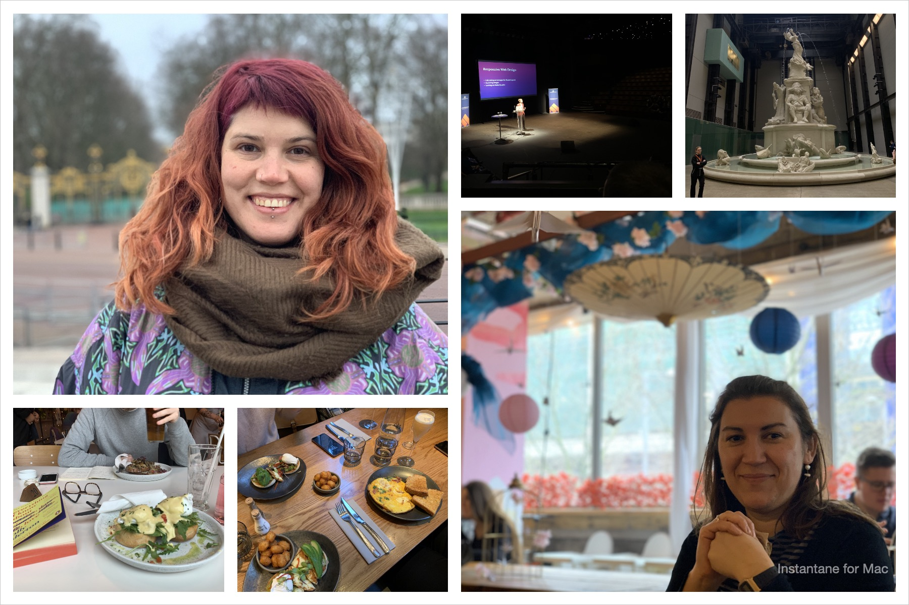

What to say about 2020, huh? It's pretty safe to say it was an awful year. I spent most of it depressed, exhausted and worried. My energy disappeared, and doing even the basic things required for me to function took all I had. 

Despite all that, I still want to reflect and record what it was like, as I hope it will be cathartic.

I guess before I dive in I should review the goals I set myself at the end of last year:

- I wanted to "do less" professionally, as I spread myself a bit too thin in 2019: I most certainly did less 😅  but the surplus energy I hoped for wasn't there for obvious reasons.
- I mentioned about being interested in DevRel: I interviewed for a DevRel position in a big company this year, and although I didn't get an offer, it was a great opportunity to get a better feel for what the role entails, and ultimately showed me I don't really want to move in that direction, at least not for now.
- I had ambitious goals around personal skills and exercise: I failed 100% of those. I did not hit a single one. In fact, I did worse on those areas than I had before setting them as goals.

This year sucked, in varied ways, and that taught me to be more accepting of myself. It taught me to assess the energy I had and act accordingly, instead of chastising myself as I usually do. I wouldn't say I'm brilliant at it yet, but I've gotten a lot better. I think that's my biggest takeaway from 2020: to be kinder to myself.

One of the things I love is taking pictures, and going back though my camera roll makes it easy to spot the darkest times, the months where I have a handful of pictures for the whole month. I still wanted to do a month-by-month section, so here they are, the highlights of a shitty year:

## January

This was a month of conferences and events (remember those?). I attended You Got This, New Adventures, ReactJS Girls and spoke at NDC London. I made new friends and hung out with old ones. I travelled, and had a lovely time.  

I also ended up on an accidental Monday night rave with my lovely friends, and it was a lot of fun 💃🏽

📖  [The Book Thief - Markus Zusak](https://uk.bookshop.org/books/the-book-thief-the-life-affirming-number-one-international-bestseller/9781784162122)

## February

After NDC I hung out in London for a week in February, and met my dearest friend Marisa who came over from Spain. I went to the Tate Modern for the first time, and ate lots of lovely food.

My family also came to visit from Devon for a few days, and I attended Frontend North, in Sheffield.

📖. [Ordinary People - Diana Evans](https://uk.bookshop.org/books/ordinary-people-shortlisted-for-the-women-s-prize-for-fiction-2019/9781784707248), [This is Going to Hurt - Adam Kay](https://uk.bookshop.org/books/this-is-going-to-hurt-secret-diaries-of-a-junior-doctor/9781509858637)

## March

The first half of March was pretty normal still, met friends, went out for meals, the usual stuff. I set up v1 of my desk at home, to work on side projects. On the 11th of March, work told us to take our laptops to work from home until further notice. My trip to IndieWebCamp London was cancelled, and everything took a turn.

At first it was all new and ok, and I did lots of things outside work. I still attended IndieWebCamp, and spent a whole weekend on zoom (!) and it was great. I also attended a drawing workshop hosted by Denise Yu and it was a lot of fun.

📖  [Everything I Know About Love - Dolly Alderton](https://uk.bookshop.org/books/everything-i-know-about-love/9780241982105), [Twas the Nightshift Before Christmas - Adam Kay](https://uk.bookshop.org/books/twas-the-nightshift-before-christmas-festive-hospital-diaries-from-the-author-of-multi-million-copy-hit-this-is-going-to-hurt/9781529018585)

🎮. [Animal Crossing](https://www.nintendo.co.uk/Games/Nintendo-Switch/Animal-Crossing-New-Horizons-1438623.html)

📺. [Frasier](https://www.imdb.com/title/tt0106004)

## April

This was a strange month. We scrambled to move all Tech Nottingham events online in a way that worked for our community. Weekends were filled with walks through the empty city, it was a bit eerie. We celebrated Thom's birthday in our flat alone.

I think I had the 'rona then, cause I had a persistent headache for a couple of weeks, and I lost my sense of taste and smell. 

🎮. [Animal Crossing](https://www.nintendo.co.uk/Games/Nintendo-Switch/Animal-Crossing-New-Horizons-1438623.html)

📺. [Brooklyn 99](https://www.imdb.com/title/tt2467372)

## May

By May, all I did was work, run events, and play Animal Crossing. I didn't have the energy for anything else. We celebrated my birthday in our flat alone.

🎮. [Animal Crossing](https://www.nintendo.co.uk/Games/Nintendo-Switch/Animal-Crossing-New-Horizons-1438623.html)

## June

In June, violence and heartbreak came into the mix. We attended the BLM protest in Nottingham, and knelt in the muddy grass for 9 minutes. 9 minutes is a long time.

Fed up of the flat, we started looking for a house to buy.

🎮. [Animal Crossing](https://www.nintendo.co.uk/Games/Nintendo-Switch/Animal-Crossing-New-Horizons-1438623.html)

📺. [The Office (US)](https://www.imdb.com/title/tt0386676)

## July

Pretty sure nothing happened in July 🤷‍♀️

📖. [Becoming - Michelle Obama](https://uk.bookshop.org/books/becoming-now-a-major-netflix-documentary/9780241334140)

🎮. [Animal Crossing](https://www.nintendo.co.uk/Games/Nintendo-Switch/Animal-Crossing-New-Horizons-1438623.html)

## August

We managed to book a farmhouse in Gloucestershire and saw my family in August. The change of scenery was good for us. We also spent a couple of days visiting Bath, a lovely city.

📖. [Unnatural Causes - Dr Richard Shepherd](https://uk.bookshop.org/books/unnatural-causes-an-absolutely-brilliant-book-i-really-recommend-it-i-don-t-often-say-that-jeremy-vine-bbc-radio-2/9781405923538)

## September

Not much happened in September. I continued my favourite activity in stressful times: rewatching sitcoms. I hit all my favourites this year, including Friends for the millionth time 😅

One small thing that cheered me up was discovering Nomo: an app that lets you take point and shoot photos with your smartphone. It has loads of camera models and it's great fun.

📺. [Friends](https://www.imdb.com/title/tt0108778)

## October

I tried to engage in activities outside of work again, and took an SVG Animation workshop. It was brilliant fun, but spending evenings on zoom after full workdays on zoom was extremely tiring.

Luckily, in October we managed to book a cottage in a forest in Scotland Borders for a week. It was the most peaceful week we had this year 💛

There was no phone signal, so we spent our days reading, walking through the forest, petting the local dog Merlot, and chilling by the fire. It was bliss ✨

📖. [Never Split the Difference - Chris Voss](https://uk.bookshop.org/books/never-split-the-difference-negotiating-as-if-your-life-depended-on-it/9781847941497), [Queenie - Candice Carty-Williams](https://uk.bookshop.org/books/queenie-british-book-awards-book-of-the-year/9781409180074), [Women & Power - Mary Beard](https://uk.bookshop.org/books/women-power-a-manifesto/9781788160612), [The Men Who Stare at Goats - Jon Ronson](https://uk.bookshop.org/books/the-men-who-stare-at-goats/9780330375481), [The Book of Dust Vol. 1 - Philip Pullman](https://uk.bookshop.org/books/la-belle-sauvage-the-book-of-dust-volume-one/9780241365854)

🎮  [Wordify](https://www.nintendo.co.uk/Games/Nintendo-Switch-download-software/Wordify-1817041.html), [Super Monkey Ball](https://www.nintendo.co.uk/Games/Nintendo-Switch/Super-Monkey-Ball-Banana-Blitz-HD-1649998.html), [Paper Mario](https://www.nintendo.co.uk/Games/Nintendo-Switch/Paper-Mario-The-Origami-King-1782440.html), [Animal Crossing](https://www.nintendo.co.uk/Games/Nintendo-Switch/Animal-Crossing-New-Horizons-1438623.html), [Trivial Pursuit](https://www.nintendo.co.uk/Games/Nintendo-Switch-download-software/Trivial-Pursuit-Live--1462491.html)

📺. [Star Trek Discovery](https://www.imdb.com/title/tt5171438), [The Jinx](https://www.imdb.com/title/tt4299972)

📽. [Enola Holmes](https://www.imdb.com/title/tt7846844), [Jojo Rabbit](https://www.imdb.com/title/tt2584384), [Spider-man: far from home](https://www.imdb.com/title/tt6320628), [Baby Driver](https://www.imdb.com/title/tt3890160), [The Rock](https://www.imdb.com/title/tt0117500)

## November

When we got back from Scotland, Nottingham was placed in tier 3, so we were immediately back in house arrest 😅

The weather started to turn, so we stayed in even more. We did, however, find a house we liked and got our offer accepted on it 🎉

I also started therapy for the very first time. 

My (book) pile of shame kept getting bigger.

📖. [The Guilty Feminist](https://uk.bookshop.org/books/the-guilty-feminist-the-sunday-times-bestseller-breathes-life-into-conversations-about-feminism-phoebe-waller-bridge/9780349010120)

🎮. [Paper Mario](https://www.nintendo.co.uk/Games/Nintendo-Switch/Paper-Mario-The-Origami-King-1782440.html), [Superliminal](https://www.nintendo.co.uk/Games/Nintendo-Switch-download-software/Superliminal-1742946.html), [What Remains of Edith Finch](https://store.playstation.com/en-gb/product/EP2333-CUSA07974_00-WHATREMAINSFINCH), [Horizon Zero Dawn](https://store.playstation.com/en-gb/product/EP9000-CUSA10213_00-HRZCE00000000000), [Fall Guys](https://store.playstation.com/en-gb/product/EP3643-CUSA17714_00-FALLGUYSPS4EU000), [The Last of Us Part 2](https://store.playstation.com/en-gb/product/EP9000-CUSA10249_00-THELASTOFUSPART2), [Star Wars Battlefront 2](https://store.playstation.com/en-gb/product/EP0006-CUSA05749_00-BATTLEFRONTII000), [Donkey Kong Tropical Freeze](https://www.nintendo.co.uk/Games/Nintendo-Switch/Donkey-Kong-Country-Tropical-Freeze-1325706.html), [Assassins Creed 2](https://store.playstation.com/en-gb/product/EP0001-CUSA04893_00-ACLEGACYHD000000)

📺  [Star Trek Discovery](https://www.imdb.com/title/tt5171438), [GBBO](https://www.imdb.com/title/tt1877368), [His Dark Materials](https://www.imdb.com/title/tt5607976)

## December

This was such a cold and dark month, so for the first time ever, I got some Christmas decorations so try and cheer us up. Organising Secret Santa at work and Tech Nottingham was really nice.

I started the process to get an ADHD assessment. It might take a while, but it's a start.

With the government guidance changes, I couldn't go see my family for Christmas, which was disappointing. However, Thom's family made up the big shed for us to have a socially distanced outdoors-ish Christmas lunch, so that was lovely 💛

I also tried my hand at crafting and really enjoyed, so stay tuned for obsessive crafting in the new year 😂

📖. [Memorias de mis putas tristes](https://uk.bookshop.org/books/memories-of-my-melancholy-whores/9780241968543)

🎮  [Assassins Creed Brotherhood](https://store.playstation.com/en-gb/product/EP0001-CUSA04893_00-ACLEGACYHD000000), [Assassins Creed Revelations](https://store.playstation.com/en-gb/product/EP0001-CUSA04893_00-ACLEGACYHD000000), [Assassins Creed Black Flag](https://store.playstation.com/en-gb/product/EP0001-CUSA00009_00-B000000000000742), [Assassins Creed Unity](https://store.playstation.com/en-gb/product/EP0001-CUSA00605_00-AC5GAMEPS4000001), [Assassins Creed Syndicate](https://store.playstation.com/en-gb/product/EP0001-CUSA02376_00-ACVPOSTSTANDEURP)

📺. [The Mandalorian](https://www.imdb.com/title/tt8111088), [Jeopardy!](https://www.imdb.com/title/tt0150377), [Schitt's Creek](https://www.imdb.com/title/tt3526078), [His Dark Materials](https://www.imdb.com/title/tt5607976), [The Good Place](https://www.imdb.com/title/tt4955642)

📽. [The Holiday](https://www.imdb.com/title/tt0457939), [Home Alone](https://www.imdb.com/title/tt0099785), [Ghostbusters](https://www.imdb.com/title/tt0087332), [Die Hard](https://www.imdb.com/title/tt0095016), [Alien](https://www.imdb.com/title/tt0078748), [Wonder Woman 1984](https://www.imdb.com/title/tt7126948)

This year was rough, but I made it through, almost whole. Many people didn't, and it breaks my heart. 

I am incredibly thankful of the lovely people around me, who really helped me through this mess, be it with a short walk, a zoom call, or a simple message. 

One of my biggest challenges in 2020 (and always, really) was the constant noise in my head about all the things I should be doing.

To combat that, I have only two goals for 2021:

- Improve my routine to include:
    - Looking after my body.
    - Looking after my mind.
    - Space to be creative and do fun things.
    - Space to maintain my relationships.
- Be accepting when things don't go to plan.

I know 2021 is not going to magically be better, but all I can do is give myself the tools to navigate  whatever life throws at me, so I can make it to the other side. I hope I'll see you there 💛