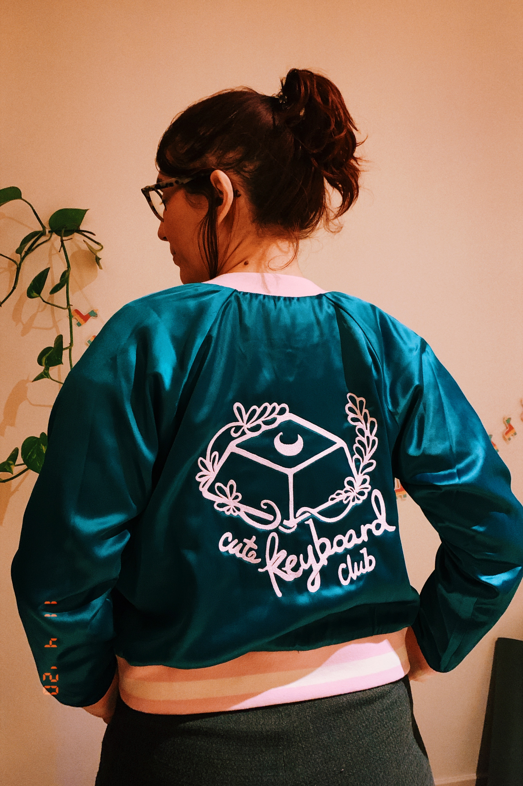
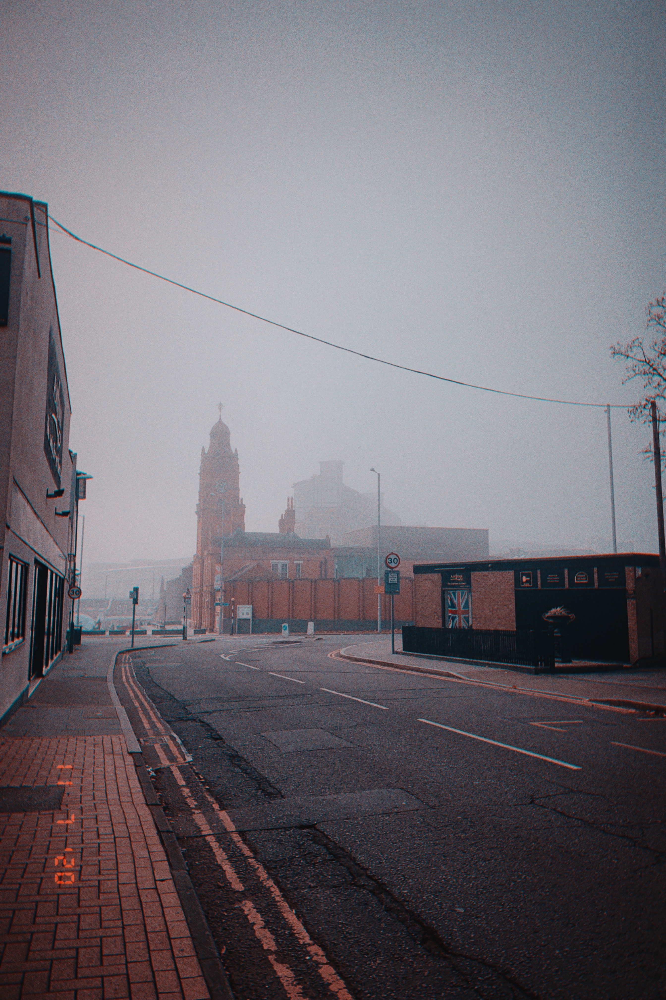

Hey friends! Hope you had a nice week and weekend. This is a bit late, but here's how my week went:

## Did

- Got back to work after a week away, couldn't really remember anything about my job 😅
- Went to see the house we're buying again, and it's still lovely 💛 just have to wait for mortgage and solicitors and other boring things 🤞🏼
- Had my first therapy session 🙌🏼
- Got a new pillow, but I didn't really get on with it.
- Started looking into micro frontends and potential architectures, very exciting 🤓
- Started migrating my site to Eleventy 👩🏼‍💻
- [The Coding Black Females Takeover at WiT Notts](https://www.technottingham.com/events/wit-november-2020) was so good! Inspirational talks and speakers, and overall just great fun 💛
- Got my flu jab
- Biden won 🎉
- Had a lovely zoom call with some of the [Tech Nottingham Slack](https://nott.tech/slack) folks, and after our convo decided to watch a sampler of UK game shows. I watched: Only Connect, Countdown, University Challenge, Mastermind, Catchphrase, Pointless, Richard Osman's House of Games, The Chase and Who Wants to be a Millionaire. Did I miss any good ones?

## Played

🎮 [Paper Mario](https://www.nintendo.co.uk/Games/Nintendo-Switch/Paper-Mario-The-Origami-King-1782440.html)  
🎮 [Superliminal](https://www.nintendo.co.uk/Games/Nintendo-Switch-download-software/Superliminal-1742946.html)  
🎮 [What remains of Edith Finch](https://store.playstation.com/en-gb/product/EP2333-CUSA07974_00-WHATREMAINSFINCH)  
🎮 [Horizon Zero Dawn](https://store.playstation.com/en-gb/product/EP9000-CUSA10213_00-HRZCE00000000000)  

## Read

🗒 [What is the internet doing to Boomers' brains?](https://www.huffingtonpost.co.uk/entry/internet-baby-boomers-misinformation-social-media_n_5f998039c5b6a4a2dc813d3d)  
📖 [The Book of Dust: Vol. 1](https://uk.bookshop.org/books/la-belle-sauvage-the-book-of-dust-volume-one/9780241365854)  
📖 [The Guilty Feminist](https://uk.bookshop.org/books/the-guilty-feminist-the-sunday-times-bestseller-breathes-life-into-conversations-about-feminism-phoebe-waller-bridge/9780349010120)  

## Watched

🎤 [Small Tech, by Laura Kalbag and Aral Balkan](https://vimeo.com/342972799)  
📺 [Star Trek Discovery](https://www.imdb.com/title/tt5171438/)  
📺 [Friends](https://www.imdb.com/title/tt0108778/)  

## Pics

_The back garden of the house we're trying to buy_

_My cute keyboard club jacket arrived 😍_

_Spooky times are still going over here in Sneinton Market 👻_